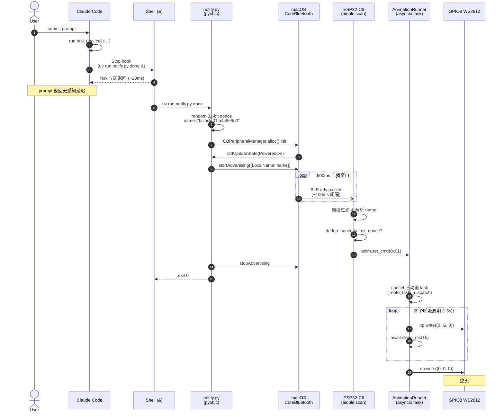
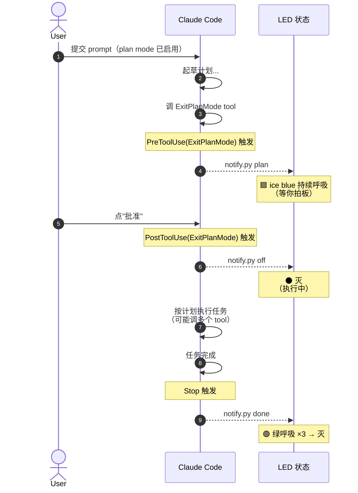

# bclock

Claude Code 任务完成 BLE 提示灯。硬件：ESP32-C6（板载 GPIO8 WS2812）。主机：macOS + `uv` + `pyobjc`（CoreBluetooth）。

## 动机

Claude Code 执行任务的时间经常长到让人切走去做别的事，回来才发现已经完成。系统通知容易漏，而桌面上一颗会呼吸发光的 LED 是"离开屏幕也能看到"的物理提醒。

## 工作原理

### 架构

三段式，**连接less BLE 广播**，全程无网络依赖：

```
┌─────────────────┐   1. Stop hook         ┌──────────────────────┐
│   Claude Code   │──────shell exec───────▶│  scripts/notify.py   │
│   (macOS)       │    (双 fork 后台)      │  pyobjc + CoreBT     │
└─────────────────┘                        └────────┬─────────────┘
                                                    │
                                    2. BLE advertise 500ms
                                    LocalName="bclock:CC:NNNN..."
                                                    │
                                                    ▼
                                        ┌────────────────────────┐
                                        │  ESP32-C6 MicroPython  │
                                        │  ┌──────────────────┐  │
                                        │  │ aioble.scan      │  │
                                        │  │ (100% duty)      │  │
                                        │  └────────┬─────────┘  │
                                        │   3. parse name →      │
                                        │      set_cmd(byte)     │
                                        │           ▼            │
                                        │  ┌──────────────────┐  │
                                        │  │ AnimationRunner  │──┼──▶ GPIO8
                                        │  │ (asyncio task)   │  │   WS2812
                                        │  └──────────────────┘  │   呼吸
                                        └────────────────────────┘
```

- **Claude Code hook**：`hooks/hooks.json` 里的 5 个 hook（`Stop` / `SubagentStop` / `PreToolUse(ExitPlanMode)` / `PostToolUse(ExitPlanMode)` / `Notification`），由 Claude Code plugin 机制加载到会话
- **`scripts/notify.py`**：PEP 723 自包含脚本，用 `pyobjc-framework-CoreBluetooth` 直调 `CBPeripheralManager` 广播 500ms 后停。单次调用 fire-and-forget，无状态、无缓存、无 daemon
- **`firmware/*.py`**：设备端 MicroPython，`aioble.scan` 100% duty cycle 被动扫描，匹配 LocalName 前缀 → 解析命令/nonce → 驱动 WS2812 动画

**为什么不用 GATT 连接？** 早期版本走 connect/write/disconnect，每次调用 macOS Core Bluetooth 建立 BLE 连接要 1.5-2s，端到端 ~2-3s，太慢。广播没有握手开销，端到端 ~300-500ms（~7x 加速）。

### 广播编码

- **LocalName**：`bclock:CC:NNNNNNNN`（18 ASCII 字符）
  - `CC` = 命令字节 hex（`00`–`04`，详见下方状态表）
  - `NNNNNNNN` = 32-bit 随机 nonce hex（防止一次广播的多个 ad 包被当成多次触发）
- **没有 Service UUID**：128-bit UUID + LocalName + Flags 会超 31 字节 ad packet 上限，macOS 会把 LocalName 挤进 scan response，设备 passive scan 就看不到了。去掉 UUID 用纯名字前缀过滤
- **没有 manufacturer data**：macOS `CBAdvertisementData*` 字典不支持

### 时序图（任务完成）

最常见的"任务完成→绿色呼吸"链路：



### 时序图（计划模式四阶段）

`plan mode → ExitPlanMode → 批准 → 执行 → 完成` 完整链路，演示 ice blue 如何被 PostToolUse 清掉、最终被 Stop 的绿呼吸覆盖：



如果你点"拒绝"而不是"批准"，没有 PostToolUse 触发，ice blue 会持续到下一个 `Stop`（你下一次让 Claude 回复结束时）才被绿呼吸覆盖——可接受的边缘情况。

### 关键设计点

**为什么 hook 命令用 `( ... & ) >/dev/null 2>&1`？**
Stop hook 是同步执行的——hook 命令不返回 Claude Code 就卡着不能交还控制。`( ... & )` 双 fork 把 notify.py 变成孤儿进程立即脱离 shell，hook 在 ~20ms 返回，后续的广播/扫描全在后台。用户完全感知不到延迟。

**为什么用广播 + 32-bit 随机 nonce 去重？**
广播本身是无状态的 fire-and-forget，一次 `startAdvertising` 在 500ms 窗口内会发出 ~5 个 ad 包，设备扫描会多次捕获同一条命令。如果不去重，单次 `notify.py done` 会让设备把绿呼吸连播 5 次。解决：每次 notify.py 生成一个 32-bit 随机 nonce 塞到 LocalName，设备记住 `last_nonce`，同 nonce 直接 drop。32-bit 碰撞率 1/4B，可以直接"同值永 drop"，不需要时间窗口判断。

**为什么不用 Service UUID 过滤而只靠名字前缀？**
128-bit Service UUID (17 字节) + LocalName (16 字节) + Flags (3 字节) = 36 字节，超过 BLE ad packet 31 字节上限，macOS 会把 LocalName 挤到 scan response；但设备用 passive scan 不读 scan response，结果名字丢了。扔掉 UUID 就能把所有 payload 塞进主 ad packet，passive scan 也能拿到。"随便谁广播 bclock: 前缀都能触发"的噪声风险在家庭/办公室环境基本为零。

**为什么设备侧用 asyncio task 取消？**
通知可能连续来（两次任务完成间隔 < 3s 的 done 动画时间）。如果让动画阻塞运行完才响应下一个，新通知会被延迟显示。`AnimationRunner.set_cmd` 每次先 `cancel()` 旧的动画 task，再 `create_task` 新的——新通知瞬间抢占，永远展示最新状态。

**为什么 plan 状态需要 PreToolUse + PostToolUse 配对？**
`PreToolUse(ExitPlanMode)` 触发时 ice blue 开始呼吸（"等你拍板"）。如果只配 PreToolUse，用户点批准后 ice blue 还会一直亮——因为 Claude 接下来去跑工具/写代码，在真正的 `Stop` 触发前没有事件能清掉 LED。所以加 `PostToolUse(ExitPlanMode)` → `notify.py off`：批准的瞬间立即清屏，执行期间灯灭，最后 `Stop` 触发绿呼吸。这样 LED 状态语义清晰：ice blue = 等你 / 灭 = 执行中 / 绿 = 完成。

**为什么 attention（深蓝）没有 PostHook 配对？**
`Notification` hook 在 Claude 需要工具权限或会话空闲时触发，但没有"用户已经做了决定"对应的清除事件。只能依赖下一个 `Stop` 触发的绿呼吸来覆盖。代价是深蓝可能持续到任务结束。要是嫌长可以加 `PreToolUse(*)` matcher → off，但会跟 plan 的 PreToolUse 冲突，需要更精细 matcher 设计。

**为什么 plugin 装作项目级而不是全局？**
`/plugin install bclock@bclock` 默认装到当前会话所在的 scope。装成项目级后只在 bclock 目录下启动 Claude Code 时才生效，避免在所有项目里都触发（比如临时的日常问答），LED 也就不会被"每次提问都闪一下"搞得疲劳。想全局启用时改 plugin 安装 scope 即可。

### 状态定义

| state     | 字节 | 动画                    | 触发 hook                   | 清除方式                              |
|-----------|------|-------------------------|----------------------------|---------------------------------------|
| done      | 0x01 | 🟢 绿色呼吸×3 (~3s)     | `Stop` / `SubagentStop`    | 自动播放完                            |
| error     | 0x02 | 🔴 红色三闪 (~1.2s)     | 手动 / 未来扩展             | 自动                                  |
| plan      | 0x03 | 🟦 冰蓝呼吸（持续）     | `PreToolUse(ExitPlanMode)` | `PostToolUse(ExitPlanMode)` → off     |
| attention | 0x04 | 🟦 深蓝呼吸（持续）     | `Notification`             | 下一个 `Stop` → done → 灭             |
| off       | 0x00 | ⚫ 熄灭                 | —                          | —                                     |

## 目录

```
.claude-plugin/   plugin 清单 + marketplace 元数据
hooks/            hooks.json（5 个 hook：Stop / SubagentStop / Pre+PostToolUse(ExitPlanMode) / Notification，路径用 ${CLAUDE_PLUGIN_ROOT}）
scripts/          notify.py（运行时广播脚本）+ flash.sh/repl.sh（固件开发工具）
firmware/         ESP32-C6 MicroPython 固件（config/led/ble_server/main/boot）
```

## 依赖

**Host：**
- macOS 12+
- [`uv`](https://github.com/astral-sh/uv)（运行 PEP 723 脚本，自动拉取 `pyobjc-framework-CoreBluetooth`）
- `mpremote`（烧录固件，`pipx install mpremote` 或 `uv tool install mpremote`）

**设备：**
- ESP32-C6（任意 ≥4MB flash 变体）
- MicroPython v1.28+（`aioble` 经 `mpremote mip install aioble` 获取）

## 安装（主机端 Claude Code plugin）

bclock 以 [Claude Code plugin](https://docs.claude.com/en/docs/claude-code/plugins) 分发。安装后 hook 自动配置，无硬编码绝对路径。

### 方式 A：从 GitHub 安装（分享给他人最便的方式）

在 Claude Code 会话里：

```
/plugin marketplace add 0x1abin/bclock
/plugin install bclock@bclock
```

第一个命令把仓库注册为一个 marketplace，第二个命令从中装 `bclock` plugin。

### 方式 B：本地开发模式（自己跑，或者还没 push 到 GitHub）

```bash
claude --plugin-dir /path/to/bclock
```

启动时会把本目录当作 plugin 加载，hook 立即生效。

### 首次蓝牙授权

任何方式装完后，**从你平时启动 Claude Code 的终端 App** 里手动跑一次：

```bash
uv run /path/to/bclock/scripts/notify.py done
```

macOS 会弹窗请求蓝牙权限，授权后当前终端 App 和它启动的所有子进程（包括 Claude Code 的 hook 进程）就都能广播 BLE 了。

## 硬件一次性配置（设备端固件）

plugin 只管主机端。**ESP32-C6 侧的 MicroPython 固件需要单独烧一次**：

```bash
# 1. 若设备尚未装 MicroPython：
#    用 esptool 或 micropython-skills 烧 ESP32_GENERIC_C6 官方 bin

# 2. 安装 aioble（设备需连 WiFi，或 mpremote 从主机代理）
mpremote connect /dev/cu.usbserial-10 mip install aioble

# 3. 推 bclock 固件
cd /path/to/bclock
./scripts/flash.sh
```

`BCLOCK_PORT` 环境变量可以覆盖默认串口 `/dev/cu.usbserial-10`。

## 手动触发（调试用）

```bash
uv run scripts/notify.py done       # 绿色呼吸×3
uv run scripts/notify.py error      # 红色三闪
uv run scripts/notify.py plan       # 冰蓝持续呼吸
uv run scripts/notify.py attention  # 深蓝持续呼吸
uv run scripts/notify.py off        # 熄灭
```

## 故障排除

**LED 没反应：**
- 检查设备是否在扫描：`mpremote connect /dev/cu.usbserial-10` 进 REPL，Ctrl+C 打断应看到 `scan: starting` / `scan: cmd 0x..` 日志
- 手动触发：`uv run scripts/notify.py done`，设备串口应出 `scan: cmd 0x1 nonce 0x...`
- macOS 蓝牙权限：系统设置 → 隐私与安全性 → 蓝牙，确认 Terminal/iTerm 已授权（pyobjc 进程继承父终端权限）

**hook 不触发：**
- 确认 plugin 已安装：会话里 `/plugin list` 应看到 `bclock` enabled
- plugin 配置变更后需要重启 Claude Code 会话
- 手动测试：`(uv run scripts/notify.py done &) >/dev/null 2>&1`

**main.py 死循环无法连接：**
```bash
mpremote connect /dev/cu.usbserial-10
# Ctrl+C 打断 main.py → 进 REPL
import os; os.remove('main.py')
```

## 协议（便于后续扩展）

BLE 广播 LocalName: `bclock:CC:NNNNNNNN`

`CC` 命令字节当前定义：

| hex   | 含义      |
|-------|-----------|
| `00`  | off       |
| `01`  | done      |
| `02`  | error     |
| `03`  | plan      |
| `04`  | attention |

`NNNNNNNN` = 32-bit 随机 nonce hex。

未来多设备场景扩展成 `bclock:CC:NNNNNNNN:<devid>` 即可，设备侧用 `split(":", 3)` 向后兼容旧格式。

## License

[MIT](LICENSE) © 0x1abin
